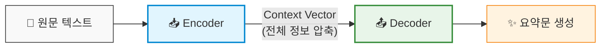
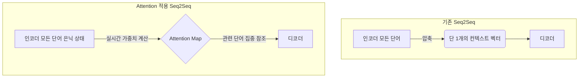

## 📌 Seq2Seq 기반 텍스트 요약 (Text Summarization)

### 1. 텍스트 요약 방식 비교
- **추출적 요약 (Extractive Summarization)**: 원문에서 핵심 문장/단어를 구절 그대로 선택하여 결합하는 방식
- **추상적 요약 (Abstractive Summarization)**: 원문의 전체 맥락을 이해한 뒤, 새로운 문장으로 재구성하여 요약문을 생성하는 방식 (본 프로젝트 적용)

---

### 2. Seq2Seq (Sequence-to-Sequence) 모델 구조
입력 시퀀스(긴 원문)를 받아 다른 길이의 출력 시퀀스(요약문)를 생성하는 인공신경망 구조로, 두 개의 RNN(LSTM/GRU) 네트워크로 구성됩니다.

- **인코더 (Encoder)**
  - 원문 텍스트를 순차적으로 읽어 들인 뒤, 전체 맥락을 하나의 고정된 고차원 벡터인 **컨텍스트 벡터(Context Vector)**로 압축
- **디코더 (Decoder)**
  - 컨텍스트 벡터를 전달받아 시작 토큰(`<sos>`)부터 시작해 요약문 단어를 한 단계씩 순차적으로 예측/생성

---

### 3. 주요 학습 및 동작 특징
- **시퀀스 처리 (Sequential Processing)**: 각 시점($t$)에서 이전 시점의 은닉 상태($h_{t-1}$)와 현재 입력($x_t$)을 이용해 순차적(`for` 루프 구조)으로 처리
- **교사 강도 (Teacher Forcing)**: 디코더 학습 시 이전 시점의 예측값 대신 실제 정답 단어를 다음 입력으로 강제 주입하여 모델 학습 속도 및 안정성 향상
- **한계점 및 개선**: 원문이 길어질 때 정보 손실(Bottleneck)이 발생하는 한계를 극복하기 위해 **어텐션 메커니즘(Attention Mechanism)**을 결합하여 성능 개선


## 🧠 LSTM (Long Short-Term Memory) 이해

### 1. 개요
**LSTM(장단기 메모리)**은 기존 바닐라 RNN의 치명적인 단점인 **장기 의존성 문제(Long-Term Dependency)**와 **기울기 소실(Vanishing Gradient)**을 극복하기 위해 고안된 순환 신경망 아키텍처입니다. 

---

### 2. 핵심 구조: 2개의 상태(State)와 3개의 게이트(Gate)

LSTM은 정보 손실 없이 먼 미래까지 맥락을 전달하기 위해 **두 가지 내부 상태**와 **세 가지 제어 게이트**를 사용합니다.

- **셀 상태 (Cell State, $c_t$)**: 장기 기억을 담당하는 컨베이어 벨트 역할하며, 덧셈(+) 위주의 연산으로 기울기 소실 방지
- **은닉 상태 (Hidden State, $h_t$)**: 단기 기억 및 해당 시점의 출력을 담당

#### ⚙️ 3가지 게이트 (Gate)
1. **망각 게이트 (Forget Gate)**: 과거 정보 중 불필요한 기억을 얼마나 삭제할지 결정 ($0 \sim 1$)
2. **입력 게이트 (Input Gate)**: 새로 들어온 정보 중 무엇을 장기 기억에 저장할지 결정
3. **출력 게이트 (Output Gate)**: 업데이트된 장기 기억 중 현재 시점의 출력으로 보낼 정보를 결정

---

### 3. Seq2Seq 모델에서의 LSTM 동작

Seq2Seq 구조에서 LSTM 기반 인코더는 입력 문장을 모두 처리한 후, 단순한 단일 벡터가 아닌 **마지막 시점의 은닉 상태($h_N$)와 셀 상태($c_N$) 한 쌍**을 컨텍스트 벡터(Context Vector)로 생성하여 디코더에 전달합니다.

- **인코더**: 입력 시퀀스 학습 후 $(h_{Encoder}, c_{Encoder})$ 생성 및 넘김
- **디코더**: 넘겨받은 상태값 쌍을 초기값으로 설정 후 시작 토큰(`<SOS>`)부터 종료 토큰(`<EOS>`) 생성 시까지 순차적 단어 예측

---

### 4. 장점 및 단점 (Key Summary)

| 구분 | 주요 내용 |
| :--- | :--- |
| **장점** | • **장기 기억 유지**: 문장이 길어져도 핵심 정보를 손실 없이 끝까지 전달<br>• **기울기 소실 해결**: 셀 상태($c_t$)의 가산(+) 구조 덕분에 역전파 시 기울기 보존 |
| **단점** | • **연산량 증가**: 3개 게이트로 인해 일반 RNN 대비 파라미터가 약 4배 증가<br>• **병렬 처리 불가**: 순차적(`for` 루프) 계산 방식으로 인한 GPU 연산 한계 존재 |


## 🔍 Attention Mechanism (어텐션 메커니즘)

### 1. 개요
**Attention(어텐션) 메커니즘**은 기존 Seq2Seq 모델이 가진 **고정 크기 컨텍스트 벡터의 정보 병목 현상(Bottleneck)** 및 **긴 문장에서의 정보 손실(Information Loss)** 문제를 해결하기 위해 도입된 핵심 아키텍처입니다.

---

### 2. 핵심 동작 원리

인코더의 마지막 은닉 상태 하나만 전달하던 기존 방식과 달리, **인코더의 모든 시점(Time Step) 은닉 상태(Hidden States)를 디코더에 제공**합니다.

디코더는 매 시점($t$) 단어를 생성(예측)할 때마다, 입력 문장의 전체 단어 중 **"현재 출력할 단어와 가장 관련이 깊은 단어가 무엇인지"** 실시간으로 계산하여 가중치(Attention Weight)를 부여합니다.

#### 💡 Q, K, V 구성 요소
* **Query (Q)**: 현재 시점 디코더의 은닉 상태 *(무엇을 찾고 있는가?)*
* **Key (K)**: 모든 시점 인코더의 은닉 상태들 *(어떤 입력 단어들이 있는가?)*
* **Value (V)**: 모든 시점 인코더의 은닉 상태들 *(각 단어가 가진 실제 정보값)*
* **Softmax**: $Q$와 $K$의 유사도를 바탕으로 각 단어에 얼마나 집중할지 $0 \sim 1$ 사이의 가중치로 환산

---

### 3. 기존 Seq2Seq vs Attention Seq2Seq 비교


### 4. 장점 및 단점 (Key Summary)

| 구분 | 주요 내용 |
| :--- | :--- |
| **장점** | • **긴 문장 처리 능력 비약적 향상**: 고정 벡터 압축 한계를 극복하여 정보 손실 최소화<br>• **설명 가능성(Interpretability) 제공**: Attention Map(가중치 시각화)을 통해 모델이 어떤 단어를 집중 참조했는지 추적 가능 |
| **단점** | • **연산량 증가**: 매 디코더 시점마다 모든 인코더 단어와의 유사도($O(N \times M)$)를 계산하여 연산 비용 상승<br>• **순차 연산 제약**: RNN/LSTM 기반 구조 위에서는 시점별 순차 처리(`for` 루프)로 인한 GPU 병렬화의 한계 존재 |


# 🚀 Deep Learning NLP Architecture: Evolution from RNN to Attention

자연어 처리(NLP) 분야에서 순차적 데이터(Sequential Data)를 처리하기 위해 발전해 온 **RNN, LSTM, Seq2Seq, 그리고 Attention Mechanism**의 핵심 개념과 아키텍처 진화 과정을 정리한 문서입니다.

---

## 🗺 Overview & Roadmap

자연어 처리 모델은 **"긴 문맥을 손실 없이 기억하고, 효율적으로 처리하는 방법"**을 찾기 위해 다음과 같은 계보로 발전해 왔습니다.

```mermaid
flowchart LR
    A[RNN] -->|기울기 소실 해결| B[LSTM]
    B -->|인코더-디코더 구조 형성| C[Seq2Seq]
    C -->|병목 현상 및 정보 유실 해결| D[Seq2Seq + Attention]
    D -->|순차 연산 제거 및 고도화| E[Transformer / LLM]


