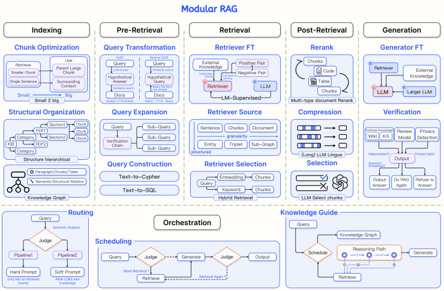

Advanced RAG는 Naive RAG의 단점(낮은 검색 정확도, 노이즈 문서 포함, 환각)을 극복하기 위해 **"검색 전(Pre), 색인 시(Indexing), 검색 후(Post)"** 전 과정에 고도화 로직을 결합한 아키텍처입니다.

---

### 1. Advanced RAG (고급 RAG) 개요

* **정의:** 단순히 질문을 벡터로 바꿔 DB를 뒤지는 Naive RAG에서 벗어나, **질문 재작성·데이터 가공·검색 결과 재정렬** 프로세스를 추가하여 검색 정밀도(Precision)와 소환율(Recall)을 극대화한 구조입니다.
* **핵심 흐름:** `Indexing Refinement` (색인 고도화) ➔ `Pre-retrieval` (질문 재작성/확장) ➔ `Retrieval` (검색) ➔ `Post-retrieval` (후처리 및 압축) ➔ `Generation` (답변 생성)

---

### 2. Indexing Refinement (색인 및 저장 고도화)

문서를 Vector DB에 넣기 전, '어떻게 자르고 어떻게 저장해야 나중에 가장 잘 찾아질까?'를 고민하는 단계입니다.

* **Chunk Size Optimization (청크 크기 최적화):**
* 문맥이 깨지지 않도록 문단/슬라이딩 윈도우(Sliding Window) 단위로 적절한 Overlap(중복) 구간을 두어 청킹합니다.

* **Parent-Document Retriever (부모-자식 문서 기법):**
* **자식 청크(작은 조각):** 검색 정밀도를 높이기 위해 임베딩 및 검색용으로 사용합니다.
* **부모 청크(큰 문맥):** 실제 LLM에 전달할 때는 자식 청크가 속한 큰 전체 문맥(Parent)을 가져와 맥락 손실을 막습니다.

* **Hierarchical Indexing (계층적 색인):**
* 문서 요약본(Summary)을 먼저 검색한 뒤, 관련 있는 세부 청크로 들어가는 2단계 색인 구조를 활용합니다.

* **Metadata Attachment (메타데이터 부가):**
* 날짜, 카테고리, 작성자, 문서 출처 등의 메타데이터를 함께 저장하여 검색 시 필터링(Filtering)을 가능하게 합니다.

---

### 3. Pre-retrieval Process (검색 전 처리)

유저의 질문(Query)을 Vector DB에 던지기 전, **질문의 질을 높여서 정답 탐색률을 극대화**하는 단계입니다.

* **Multi-Query (다중 쿼리):**
* 유저의 한 마디 질문을 LLM이 의도가 같은 여러 형태의 질문으로 확장(Re-write)하여 수평적으로 그물을 널리 칩니다.

* **HyDE (Hypothetical Document Embeddings):**
* LLM이 상식만으로 '가상의 정답 문서'를 먼저 작성해 본 뒤, 그 가상 문서의 어조/형태를 이용해 Vector DB에서 유사한 진짜 문서를 찾아냅니다.

* **Query Decomposition / Step-Back Prompting:**
* 복잡하거나 추상적인 질문을 여러 개의 세부 원자 질문(Sub-queries)으로 쪼개어 단계별로 검색을 수행합니다.

---

### 4. Post-retrieval Process (검색 후 처리)

Vector DB에서 상위 $K$개(Top-K) 문서를 가져온 뒤, **LLM에게 전달하기 직전에 데이터를 요약·정리**하는 단계입니다.

* **Reranking (리랭킹):**
* 벡터 유사도만으로는 한계가 있으므로, Cross-Encoder 같은 정밀 재정렬 모델을 사용해 문서와 질문 간의 실제 관련성을 재평가하여 최상위 순위를 다시 매깁니다.

* **Context Compression (문맥 압축):**
* 가져온 문서 조각에서 질문과 상관없는 쓰레기 텍스트(Noise)를 제거하고 정답과 직결된 핵심 문장만 압축하여 프롬프트에 넣습니다.

* **Lost in the Middle 방지 (순서 배치):**
* LLM은 컨텍스트의 맨 앞과 맨 뒤 내용을 가장 잘 기억합니다. 가장 중요한 정답 문서를 프롬프트의 맨 앞이나 맨 뒤에 배치하도록 재정렬합니다.

---

### 💡 한 눈에 보는 요약 표

| 분류 | 주요 기술 | 핵심 목적 |
| --- | --- | --- |
| **Indexing Refinement** | Parent-Document, Hierarchical Indexing | 문맥 손실 방지 및 고품질 데이터베이스 구축 |
| **Pre-retrieval** | Multi-Query, HyDE, Query Decomposition | 유저의 애매한 질문을 정제하고 탐색 범위 확장 |
| **Post-retrieval** | Reranking, Context Compression | 노이즈 제거, 순위 재정렬을 통해 LLM 환각 최소화 |

---

### 1. 상단: 5대 핵심 파이프라인 모듈 (Pipeline Modules)

문서 저장부터 답변 생성까지의 세부 과정이 기능별로 부품(Module)화되어 있습니다.

#### ① Indexing (색인 모듈)

* **Chunk Optimization (Small-to-Big):** 검색은 정밀도가 높은 작은 청크(Small)로 진행하고, LLM 전달 시에는 문맥이 풍부한 부모 청크(Big)로 확장합니다.

* **Structural Organization:** 문서의 목차/섹션 구조를 계층적(Hierarchical)으로 저장합니다.

* **Knowledge Graph:** 텍스트, 표, 단어 간의 의미적 관계를 노드와 에지로 연결하여 그래프 DB 형태(Knowledge Graph)로 구성합니다.

#### ② Pre-Retrieval (검색 전 모듈)

* **Query Transformation:**
* **HyDE:** 질문에 대한 가상 답변을 먼저 만들고, 그 가상 답변으로 진짜 문서를 검색합니다.

* **Reverse HyDE:** 문서 내용을 바탕으로 역으로 질문을 가상 생성하여 검색 정확도를 높입니다.

* **Query Expansion:** 질문을 여러 개의 세부 질문(Sub-Query)으로 분할·확장(Multi-Query)합니다.

* **Query Construction:** 자연어 질문을 데이터베이스 조회 언어인 **Text-to-Cypher**(그래프 DB용) 또는 **Text-to-SQL**(관계형 DB용)로 자동 변환합니다.

#### ③ Retrieval (검색 모듈)

* **Retriever FT (Fine-Tuning):** 지도 학습(LM-Supervised)이나 대조 학습(Contrastive Learning)을 통해 검색기 모델 자체를 미세조정합니다.

* **Retriever Source:** 문장, 청크, 문서 단위 외에도 엔티티, 서브그래프 등 다양한 입도(Granularity)의 데이터를 탐색합니다.

* **Retriever Selection (Hybrid Retrieval):** 키워드 검색(BM25)과 벡터 임베딩 검색을 결합하여 최적의 결과를 조합합니다.

#### ④ Post-Retrieval (검색 후 모듈)

* **Rerank:** 텍스트, 코드, 표 등 다양한 타입의 검색 결과(Chunks)를 질문과의 실제 관련성에 따라 재정렬합니다.

* **Compression:** LLM Lingua 기법 등을 활용해 검색 문서에서 불필요한 노이즈 단어를 쳐내고 핵심만 압축합니다.

* **Selection:** LLM이 직접 검색 결과 중 진짜 사용할 청크만 선별합니다.

#### ⑤ Generation (생성 및 검증 모듈)

* **Generator FT:** 검색기(Retriever)와 연동되어 외부 지식을 가장 잘 활용하도록 LLM을 미세조정합니다.

* **Verification (검증/자가 반성):**
* 생성된 답변이 환각(Hallucination)인지, 지식 그래프/외부 정보와 맞는지 검증합니다.

* 결과에 따라 **[답변 출력 (Output Answer)]**, **[RAG 재시도 (Do RAG Again)]**, **[답변 거부 (Refuse to Answer)]** 중 하나를 선택합니다.

---

### 2. 하단: Orchestration (스마트 조율 및 제어 영역)

질문의 성격에 따라 위 모듈들을 어떤 순서와 조건으로 가동할지 결정하는 **"지휘자(Brain)"** 역할입니다.

* **Routing (경로 분기):**
* 질문을 분석(Semantic Analysis)하여 RAG 파이프라인 1로 보낼지, 파이프라인 2로 보낼지 판단합니다.

* 검색된 청크에만 철저히 의존할지(Hard Prompt), LLM의 자체 지식도 허용할지(Soft Prompt) 결정합니다.

* **Scheduling (동적 스케줄링 / Loop):**
* **Need Retrieval?** 질문을 받고 검색이 정말 필요한지 먼저 판단합니다.

* 검색이 필요 없으면 바로 답변을 생성하고, 필요하다면 검색을 거쳐 생성 후 "재검색이 필요한가?(Retrieval Again?)"를 판단해 루프(Loop)를 돕니다.

* **Knowledge Guide (추론 경로 안내):**
* 지식 그래프(Knowledge Graph)를 참조하여 답변을 생성하기 위한 최적의 추론 경로(Reasoning Path)를 계획하고 검색을 수행합니다.

---

### 📌 요약: Modular RAG의 핵심 가치

Modular RAG는 고정된 일직선 구조가 아닙니다.
입력된 질문의 난이도와 성격에 따라 **Orchestration 영역이 나침반 역할**을 하고, 상단의 **Indexing / Pre-Retrieval / Retrieval / Post-Retrieval / Generation 모듈 중 필요한 레고 블록만 선택·조합하여 작동하는 유연한 AI 에이전트 시스템**입니다.

---
RAG에서 이 3가지는 "데이터를 어떤 크기로 잘라(청킹), 어떤 표찰을 붙여(메타데이터), 어떻게 폴더처럼 체계적으로 배열할 것인가(구조적 인덱스)"를 결정하여 LLM의 **환각(Hallucination)을 최소화하고 검색 정밀도를 극대화**하는 핵심 기반 기술입니다.

---

## 1. 청킹 전략 (Chunking Strategy): 분절에서 의미 단위로

### 💡 개념

긴 문서나 텍스트를 Vector DB에 넣기 위해 적절한 크기로 자르는 작업입니다. 과거에는 단순히 글자 수(예: 500자씩 자르기)로 무작위 절단했다면, 고급 RAG에서는 **문장, 문단, 목차 등 완결된 의미 단위**로 잘라 문맥 파악 능력을 유지합니다.

### 🔑 핵심 기법 및 작동 원리

1. **중복 구간 설정 (Overlap):**
* 자른 문장 조각의 앞뒤 끝부분에 10~20%의 동일한 단어를 겹치게 배치합니다.
* **목적:** 문장이 딱 중간에서 잘려 주어나 핵심 조건이 날아가는 문맥 절단 현상(Context Severance)을 방지합니다.

2. **의미 단위 청킹 (Semantic Chunking):**
* 글자 수가 아닌 문장의 마침표, 줄바꿈, 주제 변화 지점을 감지하여 자릅니다.

3. **부모-자식 청킹 (Parent-Child Chunking):**
* **자식 청크 (100~200자):** 검색 정밀도(Precision)를 높이기 위해 작게 쪼개어 Vector DB에 등록하는 용도입니다.
* **부모 청크 (500~1,000자):** 검색은 자식 청크로 빠르게 타격하고, 실제 LLM에 전달할 때는 자식이 속한 큰 문맥의 **부모 청크**를 던져 전달력을 극대화합니다.

---

## 2. 메타데이터 강화 (Metadata Attachments): 데이터에 '속성' 부여하기

### 💡 개념

텍스트 데이터에 **[날짜, 문서 제목, 카테고리, 작성자, 페이지, 보안 등급]** 같은 이름표(속성 데이터)를 함께 동봉하여 저장하는 기술입니다.

### 🔑 핵심 기법 및 작동 원리

1. **메타데이터 필터링 (Metadata Filtering - 사전 차단):**
* 유저 질문: *"2026년 최신 서버 설정 지침 알려줘"*
* **효과:** 단순 유사도 검색을 하면 내용이 비슷한 `2020년 구버전 지침`을 가져와 환각을 만듭니다. 이때 `date: 2026` 메타데이터 라벨로 미리 1차 필터링(Hard Filtering)을 거쳐 2026년 폴더 내 데이터만 뒤지게 만듭니다.

2. **중복 및 쓸데없는 정보 제거 (Deduplication):**
* 동일한 내용이 여러 페이지에 반복되어 결과창을 도배하지 않도록 `doc_id`나 `section_id` 메타데이터로 묶어 거르는 역할을 합니다.

3. **출처 명시를 통한 환각 감소:**
* 가져온 정보에 "이 문장은 [FastAPI 설정 가이드 3페이지] 출처임"이라는 정보가 정확히 기록되므로 LLM이 거짓말을 지어내지 않고 해당 출처에 기반해서만 답변합니다.

---

## 3. 구조적 인덱스 (Structural Index): 정보의 계층화

### 💡 개념

자른 문장 조각(청크)들을 그냥 바닥에 평평하게(Flat) 늘어놓는 것이 아니라, **원래 문서가 가졌던 목차 구조(H1 ➔ H2 ➔ H3)나 계층 관계를 트리(Tree) 형태로 엮어서 저장**하는 방식입니다.

### 🔑 핵심 기법 및 작동 원리

1. **폴더(계층) 시스템 구축:**
* 데이터를 마치 윈도우 탐색기 폴더처럼 `[상위 문서 요약] ➔ [장/절 요약] ➔ [세부 문장 조각]`의 족보를 만들어 둡니다.

2. **3중 세트 연동 구조 (문장 자르기 + 요약본 + 원본):**
* **[1] 문장 조각 (Small Chunk):** 빠르게 검색 정답 위치를 찌르는 '송곳' 역할
* **[2] 요약본 (Summary Node):** 유저 질문이 어떤 단원에 속하는지 전체 숲을 파악하는 '나침반' 역할
* **[3] 원본/부모 (Parent Chunk):** 검색에 성공했을 때 LLM에게 완벽한 상황을 이해시키는 '맥락' 역할

3. **지식 그래프 (Knowledge Graph) 연계:**
* 문장 간 계층뿐만 아니라, 데이터 속 엔티티(개념) 간의 관계(`A서버` -[연결]-> `B디비`)를 그래프망 형태로 저장하여 복잡한 연관성 질문에도 오탐 없이 답변하도록 돕습니다.

---

## 📌 한눈에 보는 종합 요약

| 분류 | 직관적 비유 | RAG 파이프라인에서의 주요 역할 | 환각(Hallucination) 방지 원리 |
| --- | --- | --- | --- |
| **청킹 전략** | 먹기 좋은 크기로 **고기 썰기** | 단어를 의미 단위로 자르고, 겹침(Overlap) 구간을 두어 문맥 손실 방지 | 문장이 반토막 나서 생기는 오해 및 잘못된 해석 차단 |
| **메타데이터 강화** | 상자에 **이름표(날짜/카테고리) 붙이기** | 검색 전 조건을 걸어 탐색 범위를 미리 격리 및 제한 | 관련 없는 구버전/타 분야 데이터를 참조하는 현상 차단 |
| **구조적 인덱스** | 이름표 붙은 상자들을 **폴더에 정리하기** | [문장 조각 + 요약본 + 원본]을 3중 세트로 묶어 계층화 | 숲(전체 맥락)과 나무(세부 문장)를 동시에 전달하여 엉뚱한 결합을 차단 |

---

### 벡터 검색의 맹점과 해법 (Dense vs Hybrid)

* **밀집 검색(Vector/Dense)의 약점:** 문맥 이해는 뛰어나지만 고유명사, 제품 번호, 희귀 전문 용어, 정확한 단어 일치(Exact Match) 검색에 취약함.
* **해법 (하이브리드 검색):** 전통적인 키워드 기반 검색(**BM25**)의 '정확성' + 벡터 검색의 '맥락 이해'를 결합하는 하이브리드(Hybrid) 검색 기법이 현재 표준 트렌드로 자리 잡음.

### 도메인 간극 문제와 해법 (Domain Adaptation)

* **문제점:** 일반 사전 학습 임베딩 모델은 범용 데이터(위키, 뉴스 등) 기반이라, 전문 분야(의료, 법률, 기업 내부 기술)의 미세한 용어 차이와 특수 언어를 제대로 구분하지 못함.
* **해법 (Fine-tuning):** 조직 내 전문 데이터셋으로 임베딩 모델을 미세 조정(Fine-tuning)하여 도메인 특화 '언어 감각'을 학습시킴.

### 최신 검색 기술의 지향점: "생성을 위한 검색"

* **패러다임의 변화:** 단순히 '관련성 높음(Similarity)'을 찾는 기존 검색에서, 'LLM이 정답을 생성하기에 얼마나 기여하는가(Reward)'를 기준으로 검색 모델을 평가.
* **동적 검색 학습 (예: REPLUG):** LLM이 생성한 답변의 피드백을 역추적하여, "이 문서를 참조했더니 답이 잘 나오네?"라는 기여도 점수를 검색 모델(Retriever)에 반영해 스스로 진화시키는 강화 학습 구조 적용.

---

### 'Lost in the Middle' 현상과 한계

* **현상:** LLM은 긴 프롬프트의 **처음과 끝에 있는 정보는 잘 기억하지만, 중간에 위치한 정보는 무시하거나 놓치는 고질적 경향**을 보임.
* **문제점:** 단순 검색 결과(Top-K) 10~20개를 그대로 나열해 프롬프트에 넣으면, 중간에 배치된 핵심 정답을 놓쳐 환각이 발생함.
* **해법:** 정답 노출 위치를 최적화하도록 **순서 재배치(Reranking)** 및 불필요 데이터 압축(Compression)이 필수적임.

### 리랭킹 (Reranking): 정보 재배치 및 필터링

* **개념:** 1차 검색기(Retriever)가 빠르게 긁어온 30~50개 문서 중, 실제 정답과의 연관성을 정밀 재평가하여 최상위 3~5개만 골라 상단에 배치하는 과정.
* **평가 기준:** 단순 벡터 유사도를 넘어 질문과의 **실질적 연관성(Relevance)** 및 정보의 다양성(Diversity)을 함께 고려.
* **트렌드:** Rerank 전용 모델(예: Cohere Rerank, BGE-Reranker)을 붙이거나, 성능이 뛰어난 LLM에게 직접 최종 순위를 매기도록 함.

### 문맥 압축 및 선택 (Context Compression): 정보 밀도 극대화

* **개념:** "컨텍스트가 길수록 좋다"는 오해를 깨고, 토큰 비용 절감 및 답변 정확도 향상을 위해 쓸데없는 수식어와 노이즈(Noise) 단어를 제거하는 기술.
* **주요 기법:**
* **LLMLingua (토큰 다이어트):** 사람은 읽기 어색하더라도 LLM의 정보 이해도를 유효하게 유지하면서 불필요한 단어를 쳐내는 프롬프트 압축 기법.
* **RECOMP (정보 응축기):** 대조 학습(Contrastive Learning)을 거친 소형 언어 모델(SLM)을 활용해 정답 정보(Positive)만 남기고 노이즈(Negative)를 정제.

### 4. 최신 트렌드: '필터-리랭커 (Filter-Reranker)' 패러다임

가벼운 SLM과 무거운 LLM의 **역할 분담 및 협업 구조**로 비용과 성능을 모두 잡는 전략.

* **1단계 - SLM (Filter):** 빠르고 가벼운 소형 모델이 수많은 검색 결과 중 쓸모없는 데이터를 1차로 빠르게 쳐냄.
* **2단계 - LLM (Reranker & Critic):** 걸러진 핵심 샘플을 정밀 재배열하고, *"이 정보가 정말 정답 생성에 도움이 되는가?"*를 비판적으로 스스로 검증(Self-Critique) 후 최종 답변 생성.

---

### 반복적 검색 (Iterative Retrieval): 꼬리를 무는 연쇄 탐색

* **개념:** 단 한 번의 검색으로 충분한 맥락을 얻지 못할 때, [검색 ➔ 중간 답변/생성 ➔ 추가 검색 ➔ 답변 보완]의 루프를 반복하는 방식.
* **효과:** 이전 검색 결과 및 생성된 텍스트를 바탕으로 부족한 정보의 힌트를 얻어 다시 검색하므로, 단판 검색에서 발생하는 정보 부재 및 환각(Hallucination)을 대폭 줄임.

### 재귀적 검색 (Recursive Retrieval): 깊이 파고드는 단계별 정밀 탐색

* **개념:** 질문이 모호하거나 문서 구조가 복잡할 때, 쿼리를 재귀적으로 정교화하며 탐색 깊이를 단계적으로 깊게 들어가는 방식.
* **주요 기법:**
* **계단식 접근 (Hierarchical):** 전체 문서 요약본을 먼저 찾아 대략적인 위치(섹션)를 파악한 뒤, 해당 구역 내부로 들어가 세부 청크를 검색.
* **CoT(Chain-of-Thought) 결합:** *"이 문제를 풀려면 먼저 A를 찾고, 그 결과를 바탕으로 B를 찾아야 해"*라는 추론 트리를 형성하여 검색.

* **효과:** 다단계 추론(Multi-hop)이 필요한 문제 및 지식 그래프/복잡 문서 탐색에서 정답률 비약적 상승.

### 적응형 검색 (Adaptive Retrieval): 스스로 결정하는 검색 타이밍

* **개념:** 모든 질문에 무조건 검색기(Retriever)를 돌리는 비효율을 막기 위해, **LLM이 스스로 "지금 검색이 필요한가?"를 판단하여 동적으로 가동**하는 방식.
* **주요 기법:**
* **확신도(Confidence) 기반 제어:** 답변을 생성하다가 모델의 다음 단어 예측 확률이 낮아지면(지식 부족 감지) 즉시 외부 검색기를 호출.
* **자기 성찰(Self-Reflection) 토큰:** 모델 내부에 `Retrieve` 또는 `Critic` 같은 특수 토큰을 두어, 외부 정보 수집 여부 및 가져온 문서의 유용성을 스스로 검증(Self-RAG 방식).

---
